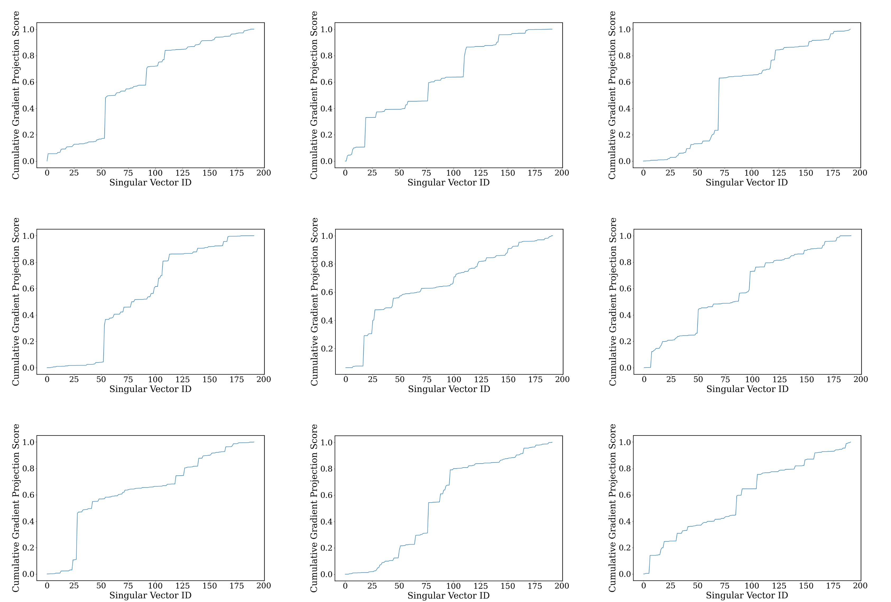
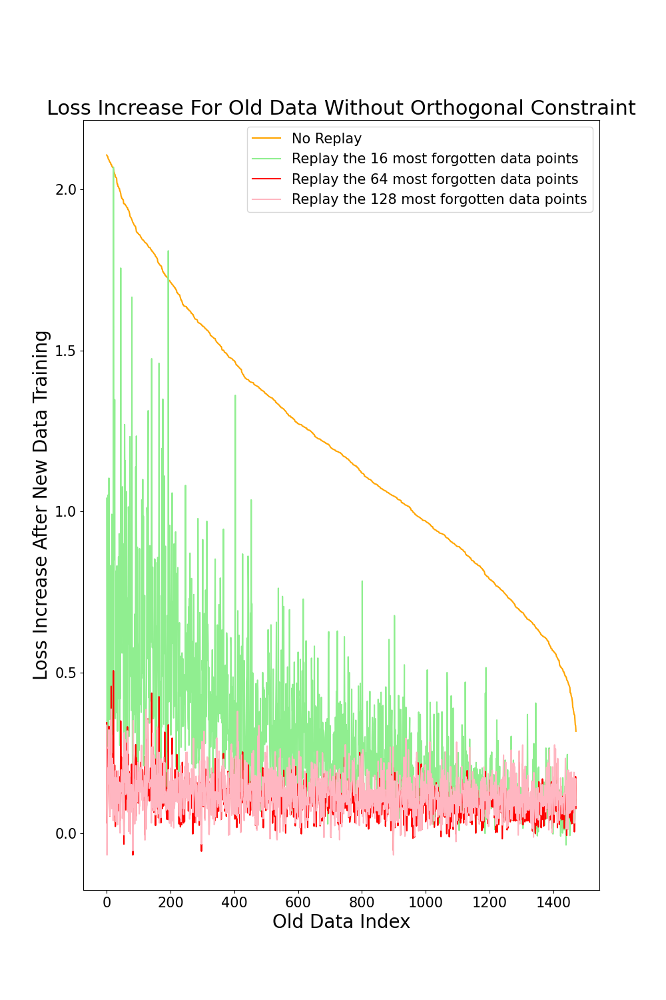

## Figure a. Cumulative projection scores of OGD-GTL gradients onto the parameter singular vectors. The projections are concentrated on top singular directions.

## Figure b. Loss increase on old data samples progressively decreases as more replay data are added, in the absence of orthogonal gradient constraints.

